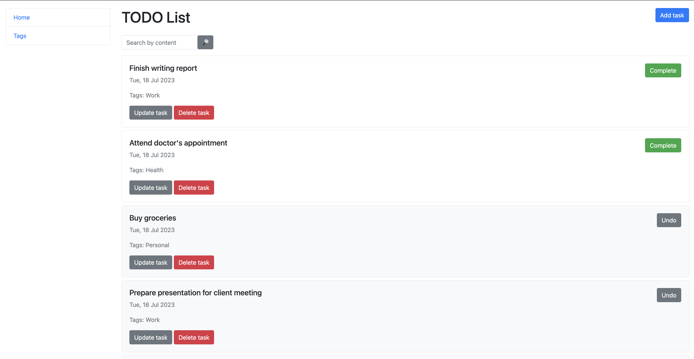

# To-Do List App

> The To-Do List is a user-friendly web application designed to streamline task management.
> Built using the Django framework and adhering to the Model-View-Template (MVT) architectural pattern,
> it offers a robust platform for creating, organizing, and managing to-do tasks efficiently.


## Installing / Getting started

Python3 must be already installed.

```shell
git clone https://github.com/olenaliuby/todo-list-app.git
cd todo-list-app/
python3 -m venv venv
source venv/bin/activate
pip install -r requirements.txt
python manage.py runserver
```

## Demo


